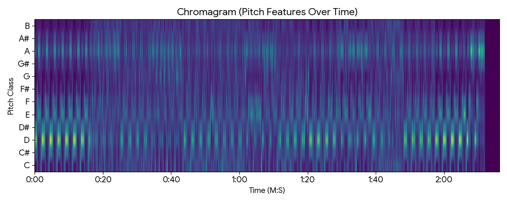
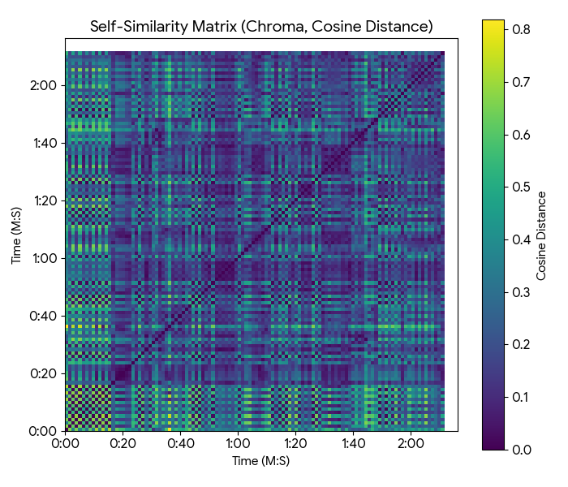
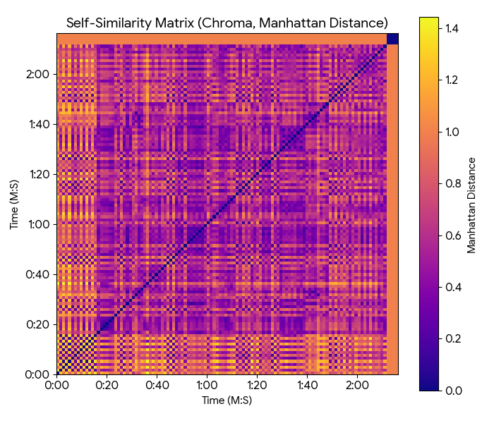

# Overview

## Row

### Column {width=60%}

::: {.card title="About This Analysis"}
For this assignment I looked at the song **"Op de block"** by Kevin and Emms. Using R, I built a chromagram and two self-similarity matrices to see how the song is structured and which notes dominate the track.

The main things I found:

- The song is mostly built on a **D Major** chord (D, F# and A)
- The beat loops almost constantly throughout the whole song
- You can clearly see where the song changes sections in the Manhattan SSM
- The waveform clips in the louder parts, which is common in hip-hop due to heavy compression
:::

### Column {width=40%}

::: {.card title="Tools used"}

| Step | Tool |
|------|------|
| Audio analysis | R |
| Pitch features | RStudio |
| Self-similarity | R |
| Plots | R / ggplot2 |
| Dashboard | Quarto |

**Sample rate:** 44 100 Hz · **Frame size:** 0.1 s · **Chroma bins:** 12
:::

# Harmonic Analysis

## Row {height=62%}

::: {.card title="Chromagram"}

:::

## Row {height=38%}

### Column {width=50%}

::: {.card title="Reading the chromagram"}
The chromagram shows how much energy each of the 12 pitch classes has at every point in the song. Brighter means more energy.

You can see that **D, F# and A** stay bright for almost the entire song — those are the notes of the D Major chord that the beat is based on. The brightness drops near the end when the track fades out.
:::

### Column {width=50%}

::: {.card title="Key and chords"}

| Pitch | Energy | Role in chord |
|-------|--------|---------------|
| **D** | Very high | Root |
| **F#** | High | Major third |
| **A** | High | Fifth |
| C# | Low | Extra colour |
| G# / A# | Very low | Rare |

Based on this, the song is in **D Major**.
:::

# Structural Analysis

## Row {height=62%}

### Column {width=50%}

::: {.card title="Self-Similarity Matrix — Cosine"}

:::

### Column {width=50%}

::: {.card title="Self-Similarity Matrix — Manhattan"}

:::

## Row {height=38%}

### Column {width=50%}

::: {.card title="Cosine SSM"}
This matrix compares each moment of the song to every other moment based on which pitches are active. The parallel diagonal lines show that the same chord pattern keeps repeating on a short cycle. This is consistent throughout verses and the chorus — the harmony basically never changes, only the vocals do.
:::

### Column {width=50%}

::: {.card title="Manhattan SSM"}
This version is more sensitive to changes in texture and timbre. The clear block pattern shows the larger sections of the song. You can see exactly where the song shifts — like going from a verse into the hook — because the blocks have sharp edges. Even though the chords stay the same, the overall sound changes enough to show up here.
:::
