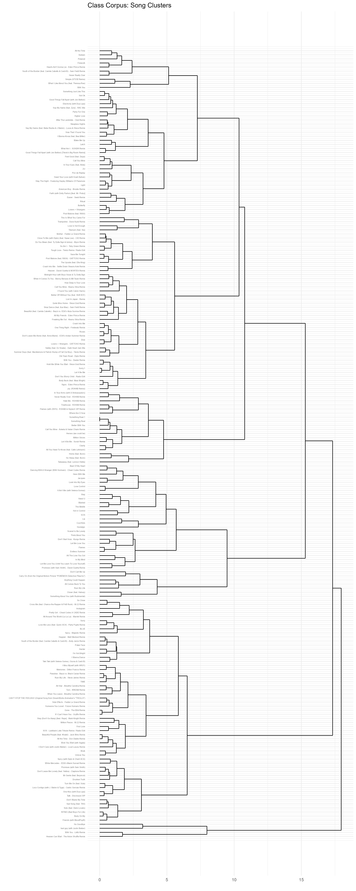
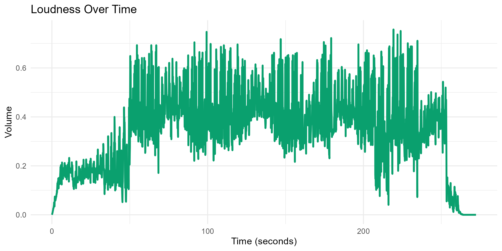
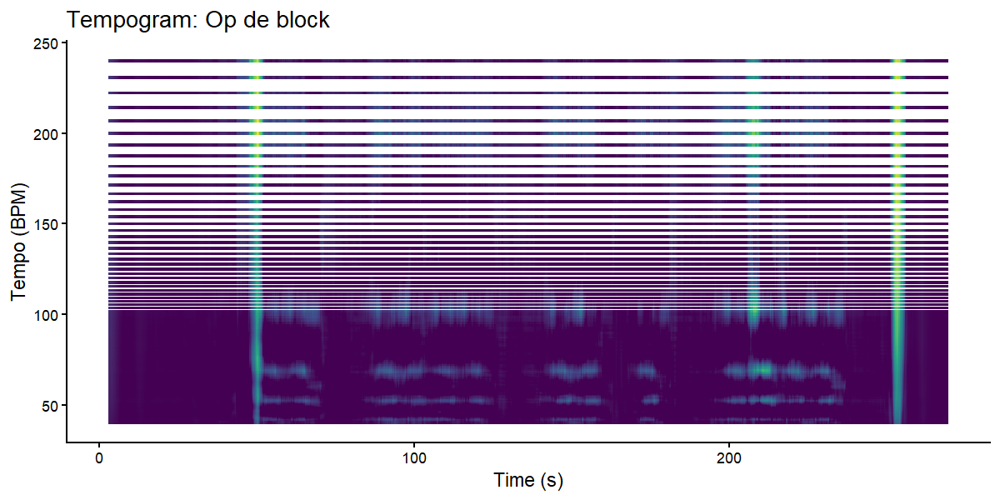

# Background & Contribution

## Row {height=100%}

### Column {width=50%}

#### Why This Track?
I picked "Op de block" by Kevin and Emms because I wanted to look at how Dutch hip-hop works under the surface. The beat in this song barely changes, the chords stay the same, and the tempo is locked the entire time. But it still sounds interesting when you listen to it. So my main question was: if nothing really changes musically, what is actually keeping the listener engaged?

That is kind of the opposite of what you normally see in pop or rock, where the chorus lifts the key or the bridge switches chords. Here, everything stays on one loop and the variety comes from the vocals and the mix instead.

I built the whole analysis in R. I used `tidyverse` for data handling, `ggplot2` for the plots, and `compmus` for extracting chroma features and building self-similarity matrices. I also pulled track-level audio features from the Spotify API using `spotifyr`. The dashboard itself runs on Quarto.

#### What Are Our Assumptions?
There are a few things we have to keep in mind about the data and tools, because they limit how confident we can be in the conclusions.

**Corpus selection.** The playlist used for the dendrogram is mostly Western pop and hip-hop. That means the clustering only shows variation within that space. If you threw in something like traditional gamelan music or Indian classical ragas, the whole tree would look completely different. So the clusters we see here are relative to what is in the playlist, not to music in general.

**Feature computation.** Spotify calculates things like "energy" and "danceability" with their own algorithms, which are not public. We just have to trust that the numbers are reasonable, but we cannot double-check exactly how they were made. On top of that, chroma features fold all octaves together, so a low C and a high C end up in the same bin. That works fine for figuring out what key a song is in, but it means we lose any information about whether a melody goes up or down. For "Op de block" that is not a big deal because the track does not really have a traditional melody, but for something like a classical piano piece it would be a real limitation.

**Data analysis.** The self-similarity matrices depend on what distance metric you pick. Cosine distance looks at which pitch classes are strong relative to each other, ignoring overall volume. Manhattan distance cares about absolute differences, so it picks up on loudness and timbre changes too. Neither one captures the order of events within a single time frame. And the tempogram uses autocorrelation of onset strength, which basically assumes that tempo equals the most common repeating pattern in the signal. If the rhythm is heavily syncopated or swung, the autocorrelation peak might not line up with what a listener would tap their foot to.

### Column {width=50%}

#### Contribution: What did we learn?
The main takeaway is that "Op de block" gets its structure almost entirely from changes in timbre and dynamics, not from harmony. The chromagram shows D, F#, and A (a D major triad) lit up for the whole song with no modulation at all. There is no dominant chord leading somewhere, no key change for the chorus, nothing like that. Tonally it just sits on one chord the whole time.

That is not lazy writing though. In hip-hop production, the whole idea is to make a short loop that grooves hard enough to repeat for three or four minutes straight. The variety comes from layering: adding or pulling out instruments, switching between rapped verses and sung hooks, automating the loudness. You can actually see this in the Manhattan self-similarity matrix, where there are clear rectangular blocks for each section. The cosine matrix, which only looks at pitch content, is basically uniform because the chords never change.

So if you only did a traditional chord-based analysis of this track, you would conclude that nothing happens. But the timbre and loudness data tell a completely different story. That means for loop-based music like hip-hop, you really need to look at more than just pitch if you want to understand how the song is put together.

#### Transfer of Learning: Who can use this?
These methods are not just for school projects. A music producer could use self-similarity matrices while mixing to check whether the structural contrasts they intended (like verse vs chorus) actually show up in the audio data. It is like getting a second opinion from the numbers instead of just trusting your ears. A DJ could compare the tempograms and Manhattan matrices of two songs to see if the tempo and texture match well enough for a smooth transition in a live set. In the broader field of music information retrieval, combining chroma and timbre self-similarity is already a common technique for automatic song segmentation. And for music students who do not have years of ear training, these visualisations make it possible to actually see things like key, structure, and dynamics that would otherwise be hard to identify just by listening.

# Corpus & Track Features

## Row {height=100%}

### Column {width=65%}

#### Class Corpus Dendrogram (194 Tracks)

### Column {width=35%}

#### Track-Level Features and Clustering
I made this dendrogram using hierarchical agglomerative clustering with Ward's method on five Spotify audio features: danceability, energy, valence, acousticness, and instrumentalness. Before computing distances I z-scored everything so that one feature does not dominate just because its raw numbers happen to be bigger.

I went with Ward's linkage because it tends to make compact clusters of roughly similar size, which is easier to read visually. If you use single linkage you get long chains, and complete linkage can make very uneven groups, neither of which is great for a 194-track playlist.

#### Where does a track like mine fit?
A hip-hop track like "Op de block" would land in the high-danceability, high-energy, low-acousticness part of the tree. According to Spotify the track is about 232 seconds long (~3:52), and from my tempogram the main tempo sits at roughly 100 BPM. Combined with the loud, compressed loudness profile, that puts it firmly in the cluster of beat-heavy, rhythmically locked material. It is far away from the branches with singer-songwriter or acoustic stuff, where acousticness is high and energy is lower. Five features is enough to pick up on broad genre differences like that, but if you wanted to tell apart sub-genres within hip-hop (like boom-bap vs trap) you would probably need more dimensions like speechiness or spectral contrast.

# Pitch (Chroma)

## Row {height=60%}

### Column

#### Chromagram: Pitch Energy

## Row {height=40%}

### Column

#### Key and Harmony
The chromagram shows how much energy each of the twelve pitch classes (C through B) has at every point in the song. Brighter means more energy.

Three pitch classes are bright the entire time: **D**, **F#**, and **A**. Those are the root, major third, and fifth of a D major chord. The fact that this pattern does not change at any point tells us the loop is harmonically static. There are no other chords sneaking in, no chromatic passing tones, nothing. In terms of harmonic rhythm (how fast the chords change), it is basically zero: the chord changes once for the entire song.

What is interesting is that even though the harmony is completely still, the track does not feel boring. That is because the chord hits are placed rhythmically in a stab-like pattern, so your ear is tracking the rhythm of the hits rather than the pitch content. The chord works more like a percussive texture than a harmonic progression.

One thing to keep in mind: because chromagrams fold all octaves together, we cannot tell the exact voicing of the chord from this graph. We do not know if the F# is above or below the A, for instance. To get that level of detail you would need a constant-Q spectrogram that preserves register information.

# Timbre & Structure

## Row {height=60%}

### Column

#### Timbre (Manhattan Matrix)

### Column

#### Harmony (Cosine Matrix)

## Row {height=40%}

### Column

#### Structural Analysis
These two self-similarity matrices show the same song from two different angles.

**Cosine matrix (right).** Cosine distance compares the shape of two chroma vectors without caring about how loud they are overall. Since "Op de block" has the same D/F#/A profile from beginning to end, the whole matrix is nearly uniform bright. Every moment sounds harmonically like every other moment. The faint diagonal lines you can see are from the short repeating cycle of the chord stabs within each bar. Basically, this matrix confirms that harmony does almost nothing to create sections in this track.

**Manhattan matrix (left).** Manhattan distance adds up the absolute differences between features, so it reacts to changes in volume and timbre. Here you can actually see clear blocks along the diagonal. Each block is a section where the sound stays consistent (for example, a verse where it is just rapping over a stripped-back beat, or a hook where the vocals are layered and the production is fuller). The sharp edges between blocks are the section boundaries: where a verse turns into a hook, where the beat drops out for a moment, or where the intro ends.

The fact that these two matrices look so different from each other is probably the most useful finding. It shows that the song's structure comes entirely from timbre and loudness changes, not from changing chords. That is pretty typical for hip-hop and electronic music in general, where the big moments (drops, switches, beat changes) are about texture, not harmony.

# Loudness & Rhythm

## Row {height=60%}

### Column

#### Loudness (Volume)

### Column

#### Tempogram (Rhythm)

## Row {height=40%}

### Column

#### Volume and Metre
**Loudness.** The RMS curve was computed in 0.1-second windows. The first ~10 seconds are basically silent, then the volume jumps up once the beat comes in. From around 40 seconds onwards the RMS bounces between roughly 0.2 and 0.7 on the normalised scale. The peaks (0.6 to 0.7) are the loudest moments like hook sections with full production, and the dips (~0.2) happen during sparser parts, like transitions or stripped-back verses. So it is not a completely flat wall of sound. There is real dynamic movement between sections, even though overall the track is heavily compressed (which is standard for commercial hip-hop, since it makes the song sound louder on streaming platforms and in clubs). The fade-out starts around 240 seconds and hits zero by about 270 seconds.

**Tempo.** The tempogram estimates the local tempo over time using autocorrelation of onset strength. For this track, there is one solid bright band at about **100 BPM** that runs straight across the whole song without any drift. You can also see a fainter band at ~200 BPM and some activity around ~50 BPM, but those are just the double-time and half-time harmonics of the autocorrelation, not actual tempo changes. The bright vertical spikes at around 30, 100, 200, and 270 seconds line up with section transitions, where the drum pattern changes briefly and causes a momentary spread in the autocorrelation before it locks back in.

The steady 100 BPM grid makes sense for a hip-hop track. The rapper's flow depends on tight synchronisation with the beat, and if the tempo drifted even slightly it would throw off the timing between syllables and drum hits. A classical piano performance would look completely different here, with the tempo band smearing vertically as the performer speeds up and slows down for expression. In this track that never happens because the beat is programmed and quantised.
